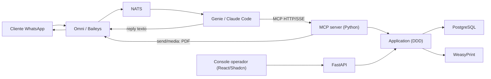

# khal-ai-challenge

[](https://github.com/edgardamasceno-dev/khal-ai-challenge/actions/workflows/ci.yml)

Agente conversacional de CX para uma **distribuidora de energia** ficticia, atendendo no **WhatsApp**. O canal e o **Omni** (Baileys), a orquestracao e o **Genie** (Claude Code), e as ferramentas de negocio sao expostas por um **MCP server em Python**.

> Status: scaffolding. O comportamento de produto e entregue por SPEC, com TDD, conforme `docs/specs/` e o fluxo de engenharia do contexto.

## O que o agente resolve

Atendimento de uma utility de energia: segunda via de fatura (com PDF no WhatsApp), status de interrupcao (outage), abertura de chamado com protocolo, consulta de SLA, base de conhecimento, insights de consumo (media/tendencia/sazonalidade/pico) e handoff humano. Notificacoes proativas de outage e baixa de pagamento sao disparadas pelo console do operador; lembretes de vencimento D-3/D-0 sao gerados por um cron deterministico (sem LLM).

## Arquitetura (resumo)



Detalhe e trade-offs em `docs/adrs/` e no contexto `../docs/09-stack-khal-ai-challenge.md`.

## Camadas

- **Sistema legado simulado**: FastAPI REST + PostgreSQL + console React (dono dos dados e acoes).
- **Integracao do agente**: MCP server que expoe ferramentas tipadas (Pydantic) com guardrails.

## Setup rapido

```bash
cp .env.example .env   # ajuste SEED_PERSONAS (numeros de demo) e credenciais
make compose-up        # database + seed (one-shot) + backend + frontend + mcp-server + gateway
```

- **Personas via `SEED_PERSONAS`** (`.env`, SPEC-006): `"Nome:telefone;..."`, de 1 a ~100.
  O serviço `seed` (Python/SQLAlchemy, idempotente) materializa a massa; re-seed do zero:
  `docker compose down -v && make compose-up`.
- **Console do operador** (React/Shadcn) em `http://localhost/` — busque uma persona de
  demo (default: `555199990001` Ana, `555199990002` Carlos, `555199990003` Joana). Ver
  `ui/README.md` e `docs/specs/SPEC-002-operator-console.md`.
- **API legada** em `http://localhost/api` — OpenAPI/Swagger em `http://localhost/api/docs`.
  Contratos: `docs/specs/SPEC-001-legacy-rest-api.md`.
- **Base de conhecimento** (`kb/` markdown) com retrieval léxico em `GET /api/kb/search`;
  alimenta a tool `search_knowledge_base` e a jornada J8. Ver `docs/specs/SPEC-005-knowledge-retrieval.md`.
- **MCP server** (ferramentas do agente) em `http://localhost/mcp` — streamable-HTTP, consome
  a API legada com guardrails determinISticos (Anti-Corruption Layer via MCP-over-REST, ADR-0017).
  Ver `docs/specs/SPEC-003-mcp-server.md`. Plugue no Claude Code:
  `claude mcp add --transport http luz-do-vale http://localhost/mcp`. A allowlist de tools tem
  **fonte unica** (`src/interfaces/mcp/allowlist.py`) com teste de paridade que impede drift entre
  server, frontmatter e evals.
- **Fatura em PDF** (`generate_invoice_pdf`): render realista A4 (PIX QR + boleto + juros)
  via WeasyPrint, persistido no **MinIO** e servido em `http://localhost/files/...` (proxy do
  gateway); `?presigned=true` devolve link com expiração. Ver `docs/specs/SPEC-008-invoice-pdf.md`.
- **Notificações proativas** (`/api/proactive`): o operador dispara, pelo console, "baixa de
  pagamento" / "status de interrupção" → evento `utilitycx.*` no **NATS** → **worker
  determinístico** (sem LLM) envia a mensagem canônica via Omni e grava em
  `conversation_memory`. Ver `docs/specs/SPEC-009-proactive-notifications.md` (ADR-0005).
- **Lembrete de vencimento D-3/D-0** (cron determinístico, sem LLM): `python -m
  src.infrastructure.events.reminder` varre faturas a vencer e emite `utilitycx.pagamento.lembrete`
  (idempotente por `(fatura_id, dia)`), reusando o worker de notificação. Ver
  `docs/specs/SPEC-026-proactive-due-reminder.md` e o runbook (§5).
- **Insights de consumo** (`get_consumption_insights`): tool MCP read-only que resume ~24 meses do
  histórico (média/tendência/sazonalidade/pico) por UC, sem LLM. Ver
  `docs/specs/SPEC-025-consumption-insights.md`.
- **Agente CX** em `agent/AGENTS.md` (+ `agent/mcp.config.json`) — papel, política e guardrails
  que orquestram as tools do `/mcp`. Avaliação ao vivo (dirige `claude -p`, sem key — ADR-0007):
  `make agent-evals` (roda via `uv run`). Pré-requisitos: (1) o stack no ar (`make compose-up`);
  (2) **Claude Code autenticado** no host (`claude login`) **ou** `ANTHROPIC_API_KEY`; (3) o runner e
  o seed do banco usando o **mesmo `SEED_PERSONAS`/`SEED_RANDOM_SEED`** — as jornadas são derivadas das
  personas, então banco e eval precisam casar (ex.: `SEED_PERSONAS="Ana Souza:...;Carlos Lima:...;Joana Pereira:..." make agent-evals`).
  O **Agent Score** (gate ≥ 85) e o histórico de passadas (criar → simular → iterar → re-simular) ficam em
  **`docs/evals/agent-score-iteracoes.md`** (Passadas 1→2→3→4: **75 → 88 → 96 → 100/100**). Ver também
  `docs/specs/SPEC-004-agent-cx.md` e `docs/operations/runbook.md`.

**Agent Score — ciclo ao vivo (criar → simular → iterar → re-simular):**

| Passada | Score | PASS/FAIL | Dívida fechada na iteração |
|---|---|---|---|
| 1 (baseline) | 75 | 18/6 | — (diagnóstico) |
| 2 | **88** ✅ | 21/3 | prompt (intenção→tool) + roteamento (modelo barato pulava a abertura) |
| 3 | **96** ✅ | 23/1 | prompt (recusa de acesso cruzado) + test-design (erro determinístico de domínio) |
| 4 | **100** 🏁 | 24/0 | test-design (precondição de memória) + assertion ancorada em tool-call |

Cada delta é rastreável a uma dívida nomeada, **sem mudança em código de negócio** (só `agent/AGENTS.md`, `src/agent/model_router.py` e o harness de eval). Detalhe passada a passada em `docs/evals/agent-score-iteracoes.md`.

Increments seguintes (WhatsApp via Omni/Genie no sandbox) seguem o rollout do ADR-0006.

## Operacao (sandbox, evals, troubleshooting)

O **runbook operacional** (`docs/operations/runbook.md`, R-18) e o roteiro reutilizavel para:
subir o stack de negocio, ligar a sandbox isolada do agente (Omni/Genie), rodar os evals,
diagnosticar problemas comuns (mcp fora da `mcpnet`, backend sem `khal-wanet`, cold-start,
midia opt-in) e o caminho de **promocao a cloud** (decisao-de-nao-fazer, ADR-0016). O passo a
passo **interativo** de login/QR/E2E WhatsApp fica em `sandbox/RUNBOOK.md`.

Adaptacoes de demo conhecidas (detalhe no runbook §6/§7):
- **Recriar o `mcp-server` sempre com os dois `-f`** (`docker-compose.yml` +
  `sandbox/compose.sandbox.yml`), senao ele sai da `mcpnet` e o agente perde as tools.
- **Recriar o `backend`** exige reconectar a rede externa `khal-wanet` + envs `OMNI_*` (`.env`),
  senao o disparo de WhatsApp falha.
- **Cold-start**: a 1a mensagem de um chat pode nao entrar na TUI — reenvie (mitigacoes no runbook §7).
- **PDF anexo**: opt-in via `sandbox/enable-media.sh` (default = so o link, isolamento intacto).

## Qualidade

Testes em Python 3.12 (unit + api dispensam banco; integration usa Postgres efemero):

```bash
make test-unit          # dominio + use cases + API (repositorios fake)
make test-integration   # repositorios contra Postgres (DATABASE_URL)
make check              # ruff + mypy + suite completa
```

### Integracao continua (GitHub Actions)

`/.github/workflows/ci.yml` roda em `push`/`pull_request` para `develop` e nas branches de
entrega. Dois jobs:

- **`quality`** (sempre, inclusive em forks sem segredo): sobe um Postgres de servico, aplica
  o schema e executa `uv sync` -> `ruff` -> `mypy` -> `pytest` (unit/api/integration). Inclui o
  teste de **paridade da allowlist** (impede o drift do PDF/contexto entre server, frontmatter
  e evals).
- **`eval-gate`** (condicional ao segredo **`ANTHROPIC_API_KEY`**): dirige o agente headless contra
  o `/mcp` e calcula um **score 0-100** (`round(100 * PASS / TOTAL)`); o **gate >= 85** reprova
  o merge. Sem o segredo (ex.: PR de fork) o job e **pulado** (skip), nao falha. Limiar
  configuravel por `EVAL_GATE_MIN` (default 85). Configure o segredo em
  *Settings → Secrets and variables → Actions* do repositorio.

A tool de memoria `get_account_events` (read-only, ADR-0005/ADR-0013, ex-`get_conversation_context`)
deixa o agente ler os **eventos de sistema** do titular no abrir da conversa (pagamento confirmado,
outage, ultimo protocolo, lembrete de vencimento); `get_chat_history` le a **transcricao** crua da
conversa (SPEC-024). A memoria e chaveada por `titular_id` (SPEC-027), evitando fragmentacao em
multi-UC / LID. Jornada concierge (boas-vindas proativo + recuperacao empatica de cliente nao
identificado) no `AGENTS.md`. Ver `docs/specs/SPEC-022-conversation-context.md`,
`docs/specs/SPEC-024-chat-history.md` e `docs/specs/SPEC-023-journey-resilience.md`.

## Mapa de documentos

- `docs/domain/` - linguagem ubiqua, modelo de dominio, dicionario de dados, ERD, personas, seed.
- `docs/adrs/` - decisoes arquiteturais.
- `docs/specs/` - especificacoes por feature (TDD).
- `docs/testing/` - estrategia de testes e rubrica de evals.
- `docs/security/` - threat model e tratamento de PII.
- `docs/operations/` - runbook operacional (subir stack, sandbox, evals, troubleshooting, cold-start, promocao a cloud).
- `agent/AGENTS.md` - papel, politica e ferramentas do agente.
- `kb/` - base de conhecimento (corpus de retrieval).

## Seguranca

Dados ficticios, sem PII real. Numeros de WhatsApp vem do `.env` (nunca commitados). Omni/Genie executam apenas em sandbox. Ver `docs/security/`.
