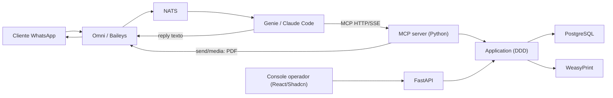

# khal-ai-challenge

Agente conversacional de CX para uma **distribuidora de energia** ficticia, atendendo no **WhatsApp**. O canal e o **Omni** (Baileys), a orquestracao e o **Genie** (Claude Code), e as ferramentas de negocio sao expostas por um **MCP server em Python**.

> Status: scaffolding. O comportamento de produto e entregue por SPEC, com TDD, conforme `docs/specs/` e o fluxo de engenharia do contexto.

## O que o agente resolve

Atendimento de uma utility de energia: segunda via de fatura (com PDF no WhatsApp), status de interrupcao (outage), abertura de chamado com protocolo, consulta de SLA, base de conhecimento e handoff humano. Notificacoes proativas de outage e baixa de pagamento sao disparadas pelo console do operador.

## Arquitetura (resumo)



Detalhe e trade-offs em `docs/adrs/` e no contexto `../docs/09-stack-khal-ai-challenge.md`.

## Camadas

- **Sistema legado simulado**: FastAPI REST + PostgreSQL + console React (dono dos dados e acoes).
- **Integracao do agente**: MCP server que expoe ferramentas tipadas (Pydantic) com guardrails.

## Setup rapido

```bash
cp .env.example .env   # numeros de demo e credenciais (fake em sandbox)
make compose-up        # database (+seed) + backend + frontend + gateway
```

- **Console do operador** (React/Shadcn) em `http://localhost/` — busque uma persona de
  demo (`555199990001` Ana, `555199990002` Carlos, `555199990003` Joana). Ver `ui/README.md`
  e `docs/specs/SPEC-002-operator-console.md`.
- **API legada** em `http://localhost/api` — OpenAPI/Swagger em `http://localhost/api/docs`.
  Contratos: `docs/specs/SPEC-001-legacy-rest-api.md`.

Increments seguintes (MCP server, WhatsApp via Omni/Genie) seguem o rollout do ADR-0006.

## Qualidade

Testes em Python 3.12 (unit + api dispensam banco; integration usa Postgres efemero):

```bash
make test-unit          # dominio + use cases + API (repositorios fake)
make test-integration   # repositorios contra Postgres (DATABASE_URL)
make check              # ruff + mypy + suite completa
```

## Mapa de documentos

- `docs/domain/` - linguagem ubiqua, modelo de dominio, dicionario de dados, ERD, personas, seed.
- `docs/adrs/` - decisoes arquiteturais.
- `docs/specs/` - especificacoes por feature (TDD).
- `docs/testing/` - estrategia de testes e rubrica de evals.
- `docs/security/` - threat model e tratamento de PII.
- `docs/operations/` - runbook e roteiro de demo.
- `agent/AGENTS.md` - papel, politica e ferramentas do agente.
- `kb/` - base de conhecimento (corpus de retrieval).

## Seguranca

Dados ficticios, sem PII real. Numeros de WhatsApp vem do `.env` (nunca commitados). Omni/Genie executam apenas em sandbox. Ver `docs/security/`.
