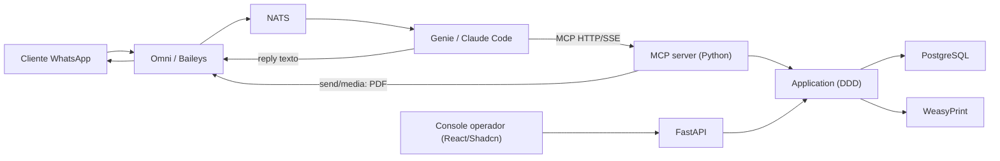

# khal-ai-challenge

Agente conversacional de CX para uma **distribuidora de energia** ficticia, atendendo no **WhatsApp**. O canal e o **Omni** (Baileys), a orquestracao e o **Genie** (Claude Code), e as ferramentas de negocio sao expostas por um **MCP server em Python**.

> Status: scaffolding. O comportamento de produto e entregue por SPEC, com TDD, conforme `docs/specs/` e o fluxo de engenharia do contexto.

## O que o agente resolve

Atendimento de uma utility de energia: segunda via de fatura (com PDF no WhatsApp), status de interrupcao (outage), abertura de chamado com protocolo, consulta de SLA, base de conhecimento e handoff humano. Notificacoes proativas de outage e baixa de pagamento sao disparadas pelo console do operador.

## Arquitetura (resumo)



Detalhe e trade-offs em `docs/adrs/` e no contexto `../docs/09-stack-khal-ai-challenge.md`.

## Camadas

- **Sistema legado simulado**: FastAPI REST + PostgreSQL + console React (dono dos dados e acoes).
- **Integracao do agente**: MCP server que expoe ferramentas tipadas (Pydantic) com guardrails.

## Setup rapido

```bash
cp .env.example .env   # ajuste SEED_PERSONAS (numeros de demo) e credenciais
make compose-up        # database + seed (one-shot) + backend + frontend + mcp-server + gateway
```

- **Personas via `SEED_PERSONAS`** (`.env`, SPEC-006): `"Nome:telefone;..."`, de 1 a ~100.
  O serviço `seed` (Python/SQLAlchemy, idempotente) materializa a massa; re-seed do zero:
  `docker compose down -v && make compose-up`.
- **Console do operador** (React/Shadcn) em `http://localhost/` — busque uma persona de
  demo (default: `555199990001` Ana, `555199990002` Carlos, `555199990003` Joana). Ver
  `ui/README.md` e `docs/specs/SPEC-002-operator-console.md`.
- **API legada** em `http://localhost/api` — OpenAPI/Swagger em `http://localhost/api/docs`.
  Contratos: `docs/specs/SPEC-001-legacy-rest-api.md`.
- **Base de conhecimento** (`kb/` markdown) com retrieval léxico em `GET /api/kb/search`;
  alimenta a tool `search_knowledge_base` e a jornada J8. Ver `docs/specs/SPEC-005-knowledge-retrieval.md`.
- **MCP server** (ferramentas do agente) em `http://localhost/mcp` — streamable-HTTP, consome
  a API legada com guardrails determinISticos. Ver `docs/specs/SPEC-003-mcp-server.md`.
  Plugue no Claude Code: `claude mcp add --transport http luz-do-vale http://localhost/mcp`.
- **Fatura em PDF** (`generate_invoice_pdf`): render realista A4 (PIX QR + boleto + juros)
  via WeasyPrint, persistido no **MinIO** e servido em `http://localhost/files/...` (proxy do
  gateway); `?presigned=true` devolve link com expiração. Ver `docs/specs/SPEC-008-invoice-pdf.md`.
- **Notificações proativas** (`/api/proactive`): o operador dispara, pelo console, "baixa de
  pagamento" / "status de interrupção" → evento `utilitycx.*` no **NATS** → **worker
  determinístico** (sem LLM) envia a mensagem canônica via Omni e grava em
  `conversation_memory`. Ver `docs/specs/SPEC-009-proactive-notifications.md` (ADR-0005).
- **Agente CX** em `agent/AGENTS.md` (+ `agent/mcp.config.json`) — papel, política e guardrails
  que orquestram as tools do `/mcp`. Avaliação ao vivo (dirige `claude -p`, sem key — ADR-0007):
  `make agent-evals` (requer o stack no ar + Claude Code autenticado). Ver `docs/specs/SPEC-004-agent-cx.md`.

Increments seguintes (WhatsApp via Omni/Genie no sandbox) seguem o rollout do ADR-0006.

## Qualidade

Testes em Python 3.12 (unit + api dispensam banco; integration usa Postgres efemero):

```bash
make test-unit          # dominio + use cases + API (repositorios fake)
make test-integration   # repositorios contra Postgres (DATABASE_URL)
make check              # ruff + mypy + suite completa
```

## Mapa de documentos

- `docs/domain/` - linguagem ubiqua, modelo de dominio, dicionario de dados, ERD, personas, seed.
- `docs/adrs/` - decisoes arquiteturais.
- `docs/specs/` - especificacoes por feature (TDD).
- `docs/testing/` - estrategia de testes e rubrica de evals.
- `docs/security/` - threat model e tratamento de PII.
- `docs/operations/` - runbook e roteiro de demo.
- `agent/AGENTS.md` - papel, politica e ferramentas do agente.
- `kb/` - base de conhecimento (corpus de retrieval).

## Seguranca

Dados ficticios, sem PII real. Numeros de WhatsApp vem do `.env` (nunca commitados). Omni/Genie executam apenas em sandbox. Ver `docs/security/`.
