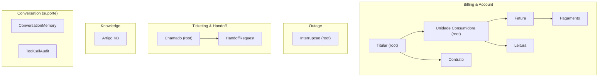

# Modelo de dominio (DDD)

Arquitetura hexagonal. O dominio nao conhece framework, banco nem Omni.

## Bounded contexts

## Aggregates e entidades

- **Billing & Account**
  - `Titular` (raiz): identidade do cliente; CPF, contatos.
  - `UnidadeConsumidora` (raiz): numero, endereco, classe, subgrupo, status; possui `Fatura` e `Leitura`.
  - `Fatura`: mes de referencia, consumo, valor, bandeira, vencimento, status; possui `Pagamento`.
  - `Contrato`: liga titular e UC; modalidade e vigencia.
- **Outage**
  - `Interrupcao` (raiz): area afetada (bairro/cidade/uf), tipo, causa, inicio, previsao de retorno, status.
- **Ticketing & Handoff**
  - `Chamado` (raiz): protocolo, tipo, descricao, SLA, status.
  - `HandoffRequest`: motivo, status na fila, operador.
- **Knowledge**
  - `Artigo`: slug, titulo, corpo markdown, tags.
- **Conversation (subdominio de suporte)**
  - `ConversationMemory`: estado curto por `chatId` (ex.: ultima UC consultada, ultimo protocolo).
  - `ToolCallAudit`: registro de cada chamada de ferramenta MCP (tabela `tool_call_audit`). Materializado em T3 (ADR-0012): ORM + sink atrás do port `ToolCallAuditSink`, gravado por um RECORDER que mascara PII (telefone → sufixo; CPF nunca em claro), mede `latency_ms`, deriva `result_status` (`ok`/`error`/`denied`) e emite log estruturado — tudo **best-effort** (auditoria nunca derruba a tool nem altera guardrails).

## Value objects

`CPF`, `Telefone` (E.164 sem '+'), `Dinheiro` (BRL, inteiro em centavos), `MesReferencia` (YYYY-MM), `Protocolo`, `TipoChamado` (enum; expoe `sla_horas`), `StatusChamado` (enum: `aberto`/`resolvido`).

Regra: value objects validam invariantes na construcao (ex.: `CPF` rejeita digito verificador invalido).

## Domain events

| Evento | Disparado quando | Efeito |
| --- | --- | --- |
| `LeituraRegistrada` | leitura mensal lancada | gera base para `FaturaEmitida` |
| `FaturaEmitida` | fatura criada | disponibiliza segunda via |
| `FaturaPaga` (PaymentRegistered) | baixa de pagamento | notifica cliente (sem LLM) + atualiza memoria |
| `InterrupcaoAberta` (OutageOpened) | operador lanca outage | notifica UCs da area + atualiza memoria |
| `InterrupcaoEncerrada` | retorno do fornecimento | notifica restabelecimento |
| `ChamadoAberto` | tool `create_ticket` | gera protocolo + inicia SLA |
| `HandoffSolicitado` | agente escala | cria item na fila do console |

Eventos de notificacao (`FaturaPaga`, `InterrupcaoAberta`, `InterrupcaoEncerrada`) seguem ADR-0005: outbound determinístico, sem LLM, alimentando contexto.

## Ports principais

| Port | Responsabilidade |
| --- | --- |
| `*Repository` | persistencia de cada aggregate |
| `ChannelPort` | enviar texto/midia ao WhatsApp (adapter Omni REST) |
| `PdfPort` | renderizar PDF de fatura (adapter WeasyPrint) |
| `KnowledgeRetrievalPort` | buscar na KB (Strategy: filesystem lexico no MVP; Postgres FTS / pgvector pos-MVP) |
| `EventBusPort` | publicar/consumir domain events (adapter NATS) |
| `ConversationMemoryPort` | ler/gravar memoria por chat |

## Mapa para ferramentas MCP

| Tool | Use case (application) | Contexts |
| --- | --- | --- |
| `find_customer_by_phone` | identificar titular | Billing, Conversation |
| `list_contracts` / `get_invoice_status` | consultar conta | Billing |
| `generate_invoice_pdf` | emitir 2a via + enviar PDF | Billing + Channel/PDF |
| `get_outage_by_region` | status de interrupcao | Outage |
| `create_ticket` / `get_ticket_status` | atendimento | Ticketing |
| `request_human_handoff` | escalar | Ticketing/Handoff |
| `search_knowledge_base` | RAG na KB | Knowledge |
