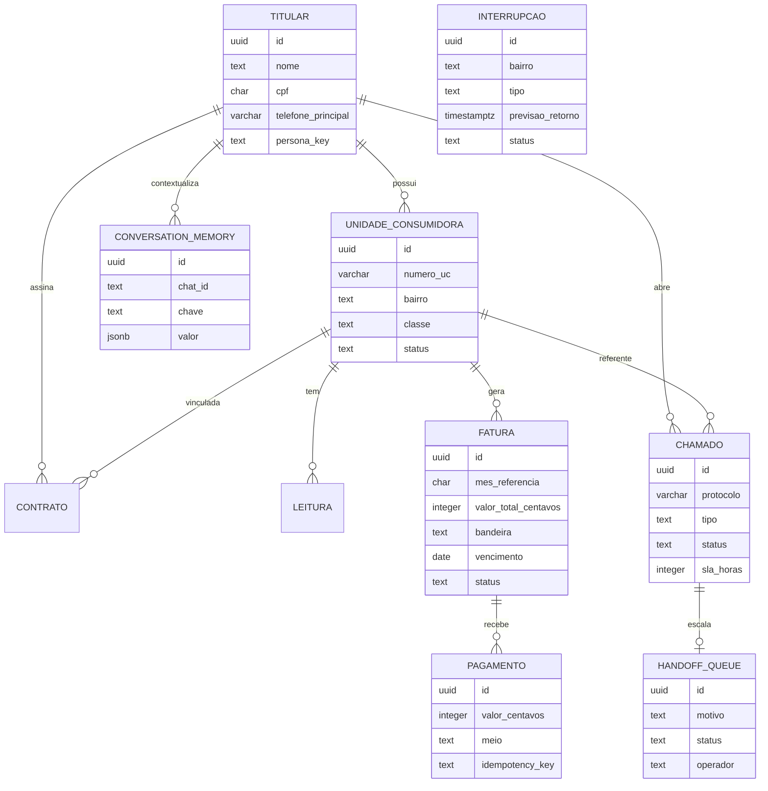

# Diagrama entidade-relacionamento

Nota: `INTERRUPCAO` nao tem FK direta para `UNIDADE_CONSUMIDORA`; a associacao e por **match de bairro + cidade + uf** no momento da consulta/notificacao (modelo realista de outage por area).
